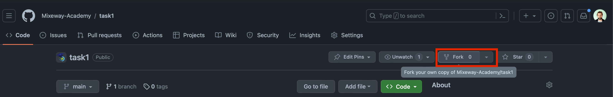

# Security By Design - Zadanie 4

## Wymagania
1. Zainstalowana komenda `git` na stacji roboczej
2. Zainstalowany `docker` na stacji roboczej
3. Bezpośredni dostęp do internetu (nie przez proxy)

## Przygotowanie
1. **Założenie konta na GitHub** (jeśli jeszcze nie jesteś zarejestrowany)  
   Aby wykonać ćwiczenie, konieczne jest posiadanie zarejestrowanego użytkownika na portalu github.com.

2. **Wykonanie "fork'a" projektu**  
   Wykonaj "fork'a" projektu [https://github.com/Mixeway-Academy/task4](https://github.com/Mixeway-Academy/task4) - w wyniku tej operacji, w twojej przestrzeni na GitHubie powstanie kopia repozytorium.  
   Zadanie zakłada wykonanie listy operacji na kodzie źródłowym, ale aby nie wprowadzać zmian w przestrzeni, z której korzystają inni użytkownicy, wygodnie jest wykonać kopię w swojej przestrzeni. Więcej informacji znajdziesz [tutaj](https://docs.github.com/en/get-started/quickstart/fork-a-repo).  
   

3. **Pobranie kopii projektu na swoją stację roboczą**
   Aby pobrać 'sforkowany' projekt na swoją stację roboczą, wykonaj poniższą komendę:

```shell
git clone https://github.com/{username}/task4
cd task4
#gdzie {username} to nazwa użytkownika. Wchodząc w swoją kopie repozytoroium przez przeglądarkę można też skorzystać z adresu URL.
```

Zadania 1 i 2 są opcjonalne. Polegają one na lokalnym uruchomieniu narzędzi trivy i semgrep - istotne jest urchomienie tych testów w procesie CICD - uruchomienie ich lokalnie jednak może przyspieszyć proces konfiguracji procesu CICD i lepiej zrozumiec cel zadania.

## 1 Zadanie (opcjonalne): Trivy na lokalnie zbudowanym obrazie Dockera

**Cel:**
* Przeprowadzenie testu skanującego obraz kontenerowy przy użyciu Trivy
* Zweryfikowanie podstawowych raportów bezpieczeństwa uzyskiwanych z Trivy

### Instrukcje do realizacji:
1. Zbuduj obraz docker z wykorzystaniem `docker build -t myapp:latest .`, Upewnij się, że obraz został utworzony (np. poleceniem docker images)
2. Zainstaluj Trivy lub uruchom trivy z wykorzystaniem docker'a
* [Windows] Zainstaluj Trivy (np. przez Chocolatey lub pobierz binarkę z repozytorium GitHub).
* [MacOS] `brew install aquasecurity/trivy/trivy`
```shell
trivy image myapp:latest
```
W przypadku docker'a:
```shell
docker run --rm \
    -v /var/run/docker.sock:/var/run/docker.sock \
    aquasec/trivy image myapp:latest
```
3. Sprawdź listę potencjalnych podatności oraz poziomy ryzyka, jakie zwraca Trivy.

### Oczekiwany wynik
**Opcjonalne**: Uzyskanie raportu o podatnościach z obrazu Dockera i potwierdzenie, że test działa poprawnie


## 2 Zadanie (opcjonalne): SAST z wykorzystaniem Semgrep

**Cel:**
* Zapoznanie się z narzędziem Semgrep do statycznej analizy kodu (SAST)
* Weryfikacja, w jaki sposób Semgrep może wykrywać potencjalne błędy i podatności w kodzie źródłowym


### Instrukcje do realizacji
1. Uruchom Semgrep lokalnie w Dockerze:
```shell
docker run --rm \
    -v "$(pwd)":/src \
    returntocorp/semgrep semgrep scan
```
2. Semgrep zwróci potencjalne miejsca w kodzie, gdzie mogą występować błędy lub podatności (np. użycie funkcji niebezpiecznych, brak sanitacji danych itp.).


### Oczekiwany wynik
**Opcjonalne**: Uzyskanie raportu SAST z wykorzystaniem Semgrep i potwierdzenie, że reguły działają prawidłowo.


## 3 Zadanie (obowiązkowe): Przygotowanie procesu CI/CD z wykorzystaniem Trivy i Semgrep

**Cel:**
* Zbudowanie kompletnego procesu CI/CD w GitHub Actions lub GitLab CI, który:
  * Będzie wykonywał skanowanie obrazu kontenerowego (lub skanowanie zależności kodu) za pomocą Trivy
  * Będzie przeprowadzał SAST z wykorzystaniem Semgrep
* Automatyzacja testów bezpieczeństwa w ramach procesu Continuous Integration


### Instrukcje do realizacji
1. Utwórz plik workflow w repozytorium GitHub w katalogu `.github/workflows/`, np. `security-scan.yml`.
2. Przykładowa zawartość pliku security-scan.yml może wyglądać następująco:
```shell
name: Security Scan

on:
  push:
    branches: [ "main" ]
  pull_request:
    branches: [ "main" ]

jobs:
  security-tests:
    runs-on: ubuntu-latest

    steps:
      - name: Check out code
        uses: actions/checkout@v2

      - name: Build Docker image
        run: |
          docker build -t myapp:latest .

      - name: Run Trivy scan
        uses: aquasecurity/trivy-action@v0.10.0
        with:
          image-ref: 'myapp:latest'
          vuln-type: 'os,library'
          format: 'table'

      - name: Install Semgrep
        run: |
          sudo pip install semgrep

      - name: Run Semgrep SAST
        run: |
          semgrep --config p/security-audit --error --json .
```
W powyższym przykładzie:
* Budujemy obraz Dockera myapp:latest.
* Uruchamiamy skan z użyciem Trivy (action trivy-action).
* Instalujemy i uruchamiamy Semgrep.
3. W przypadku realizacji z wykorzystaniem GitLab CI:
  * Utwórz plik `.gitlab-ci.yml` w repozytorium GitLab CI
  * Przykładowa zawartość może wyglądać następująco:
```shell
stages:
  - build
  - security

build_job:
  stage: build
  script:
    - docker build -t myapp:latest .

trivy_scan:
  stage: security
  image: docker:stable
  services:
    - docker:dind
  script:
    - apk add --no-cache curl
    - curl -sfL https://raw.githubusercontent.com/aquasecurity/trivy/main/contrib/install.sh | sh -
    - ./trivy image myapp:latest

semgrep_scan:
  stage: security
  image: returntocorp/semgrep
  script:
    - semgrep --config p/security-audit --error --json .
```
W powyższym przykładzie:
* W etapie „build” budujemy obraz Dockera.
* W etapie „security” uruchamiamy skanowanie Trivy i Semgrep.

### Oczekiwany wynik
**Obowiązkowe:**
* Stworzenie procesu CI/CD, który realizuje testy z wykorzystaniem Trivy i Semgrep.
* Stworzenie Pull Requesta (na GitHub) lub Merge Requesta (na GitLab), zawierającego:
  * Zmiany w kodzie (dodanie pliku security-scan.yml albo .gitlab-ci.yml oraz ewentualnie modyfikacje Dockerfile/kod projektu).
  * Link do zadania w CI/CD, które się wykonało i pokazało wynik testów.

## 4 Zadanie (obowiązkowe): Uruchomienie aplikacji lokalnie + DAST z wykorzystaniem ZAP

**Cel:**
* Zweryfikowanie dynamicznego bezpieczeństwa aplikacji uruchomionej w kontenerze
* Poznanie narzędzia OWASP ZAP w trybie automatycznego skanowania (ZAP auto scan)
* Porównanie wyników DAST (ZAP) z wynikami SAST (Semgrep) i SCA (Trivy)


### Instrukcje do realizacji
1. Uruchom aplikacje `docker run -p 8080:8080 myapp:latest`
2. Upewnij się, że aplikacja działa np. przez przeglądarkę wchodząc na `http://localhost:8080`
3. Uruchom OWASP ZAP (możesz użyć obrazu Dockera lub instalacji lokalnej)
```shell
docker run -u zap -p 8089:8081 -v $(pwd):/zap/wrk/:rw -i zaproxy/zap-stable zap-baseline.py \
  -t http://host.docker.internal:8080 \
  -r zap_report.html
```
W przypadku windows'a:
```shell
docker run -u zap -p 8089:8081 -v %cd%:/zap/wrk/:rw -i zaproxy/zap-stable zap-baseline.py \
  -t http://host.docker.internal:8080 \
  -r zap_report.html
```
4. Po zakończeniu skanowania, ZAP wygeneruje raport (np. zap_report.html), który zawiera znalezione podatności (np. XSS, SQLi, niebezpieczne nagłówki HTTP).
5. Porównaj wyniki z tymi, które uzyskałeś w testach SAST (Semgrep) i SCA (Trivy).


### Oczekiwany wynik
* Uruchomienie DAST (OWASP ZAP) i opis w PR (z zadania 3) rodzajów podatności wykrytych przez DAST, a niewykrytych przez SAST/SCA oraz wyjaśnienie, dlaczego takie różnice w wynikach występują.


## Ocenianie
Oceniany jest PR, który zawiera:
- konfiguracje CI z zadania 3
- treść zawierającą link do uruchomionego i zrealizowanego job'a z zadania 3
- tresc zawierającą wnioski z zadania 4

## Credits
* Java application - [GitHub Repo](https://github.com/pedrohenriquelacombe/spring-thymeleaf-crud-example)
* Python application - [GitHub Repo](https://github.com/MohammadSatel/Flask_Book_Library)
* JWT application - [GitHub Repo](https://github.com/onsecru/jwt-hacking-challenges)
